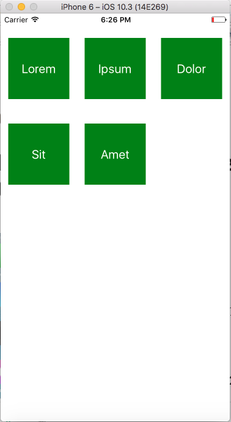

A React-Native component to render equally sized and evenly spaced square tiles.
I wrote about how this works [here](https://medium.com/@emilios1995/implementing-a-tile-view-in-react-native-a-la-ios-12f94c084f4b)


## Installation
`npm install --save react-native-tiles`

## Screenshots




## Usage

```js
import Tiles from "react-native-tiles";

class ReactNativeTiles extends Component {
  constructor(props) {
    super(props);
    const ds = new ListView.DataSource({
      rowHasChanged: (r1, r2) => r1 !== r2
    });
    this.state = {
      dataSource: ds.cloneWithRows(["row 1", "row 2"])
    };
  }
  render() {
    return (
      <View style={{ flex: 1 }}>
        <Tiles
          style={{ marginTop: 10 }}
          dataSource={this.state.dataSource}
          tilesPerRow={2}
          renderItem={(text, size) => (
            <Tile text={text} />
          )}
        />
      </View>
    );
  }
}

const Tile = ({text}) => {
  return (
    <View style={styles.item}>
      <Text>{text}</Text>
    </View>
  );
}
```

## Props

#### dataSource (required)
Type: `ListView.DataSource`

This is the same `DataSource` object you would use in `react-native`'s `ListView`

#### tilesPerRow
Type: `Number`,
Default: `3`

Tiles per row. The Tiles will be sized to be as big as possible while having an even, equal space between them 

#### renderItem (required)
Type: `Function (itemData -> size -> Component)`

This is like the `renderRow` function in `ListView`. But here the function also gives you the resulting size of the tile. This is useful when you want to fill the Tile with an Image. For example:
```js
<Tiles
   renderItem={(text, size) => (
     <Image
       style={{ width: size, height: size }}
       source={{ uri: "https://unsplash.it/400/400/?random" }}
     />
 ...
  )
```

